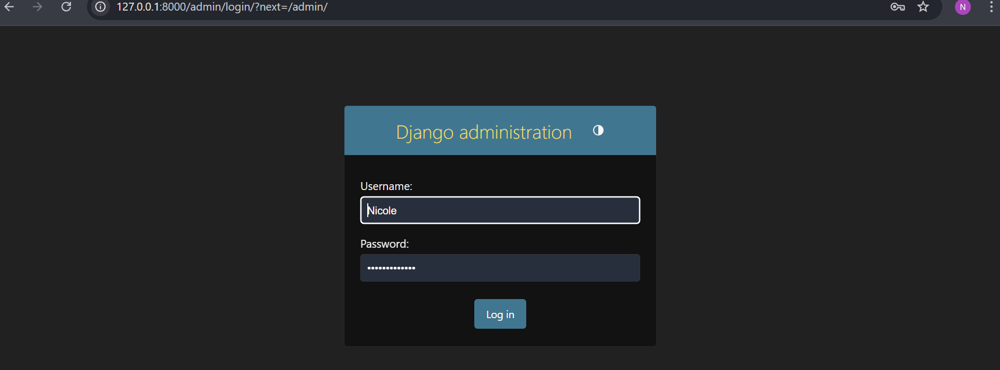
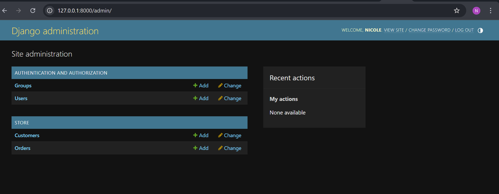
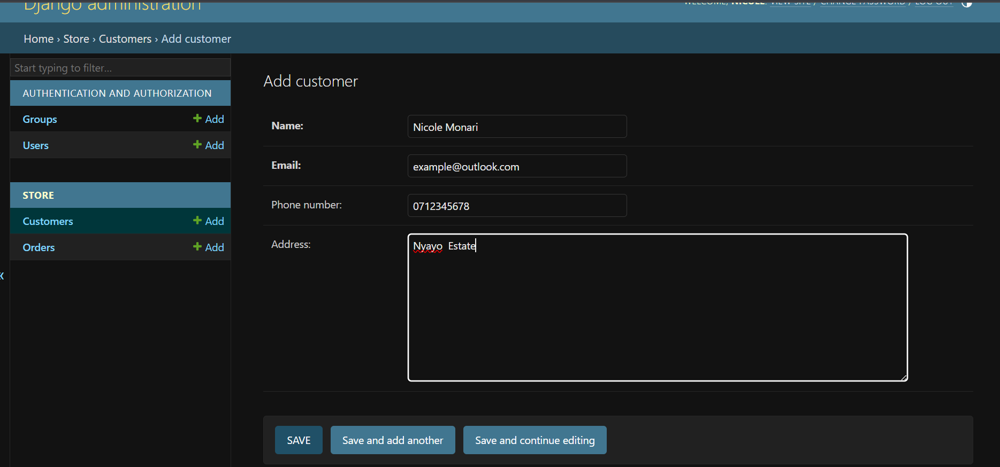
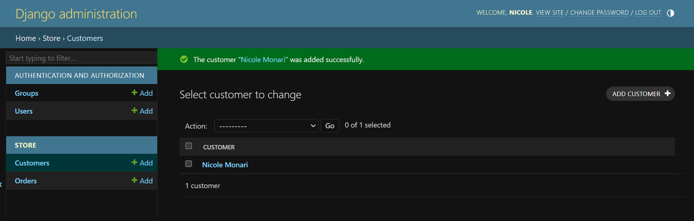

# 168330 Monari Nicole Gesare 2.2C
# DjangoModel_CAT2

A simple project that demonstrates the relationship between two models: **Customer** and **Order**.

## Overview of the project

This project is designed to show how to manage a one-to-many relationship in Django, where:  
- A **Customer** can place multiple **Orders**.  
- Each **Order** is associated with only one **Customer**.

---

## Features

- **Customer Model**:  
  - Stores customer details such as name, email, phone number and address. 

- **Order Model**:  
  - Records information about each order, including the order date and total amount.  

- **Relationship**:  
  - A single customer can be linked to multiple orders, but each order is connected to only one customer.

- **Admin Panel**:  
  - Manage customers and orders easily through Django's built-in admin interface.

---

## How to Use

1. Access the admin panel by running the project and navigating to the provided URL.  
2. Log in with the superuser account created during setup.  
3. Add and manage customers and their respective orders.

---
## Below are some screenshots of the Admin panel for demonstration purposes

